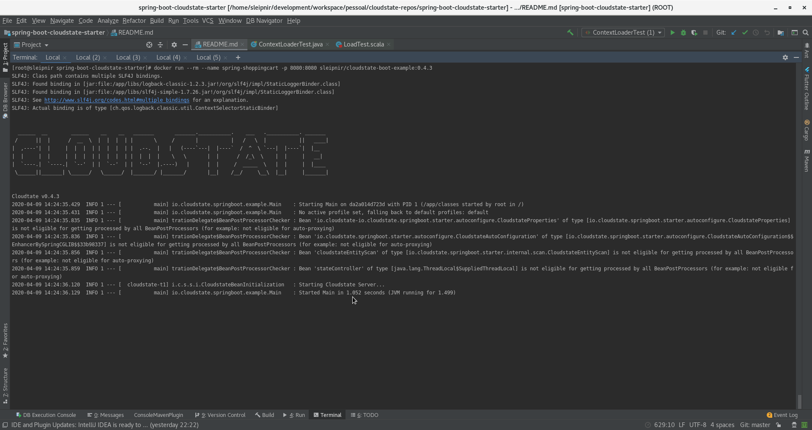
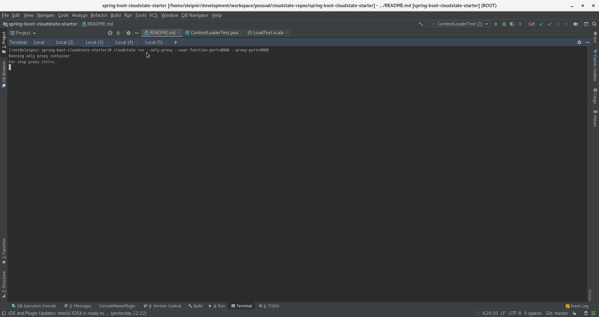
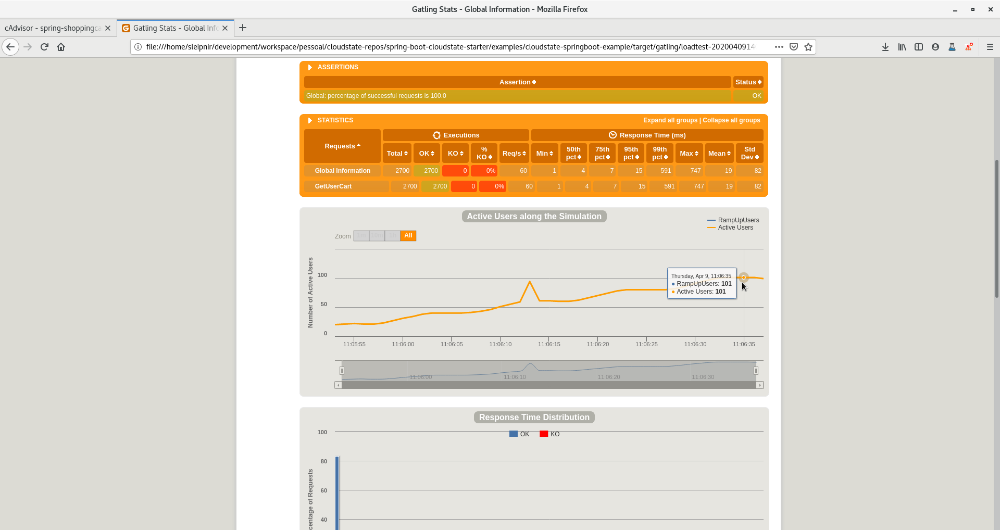
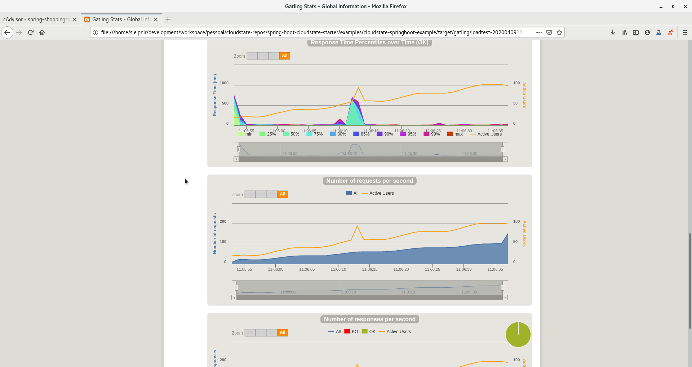
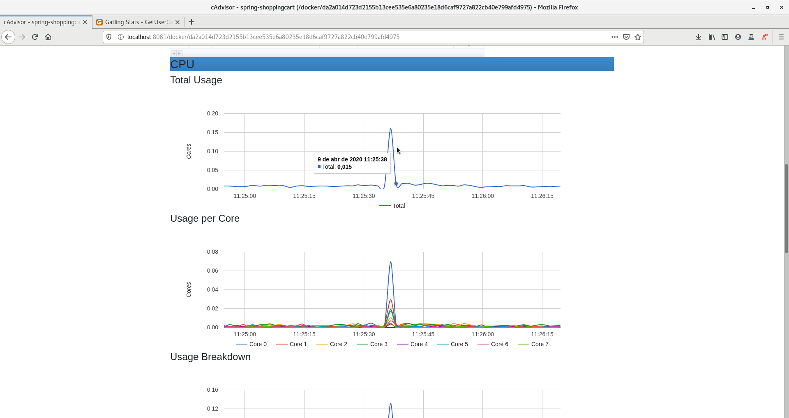
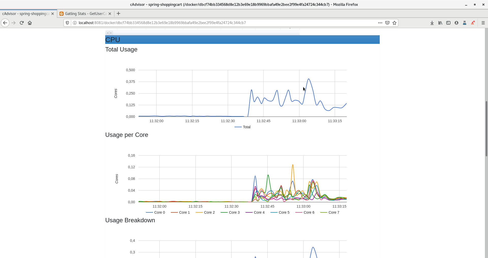
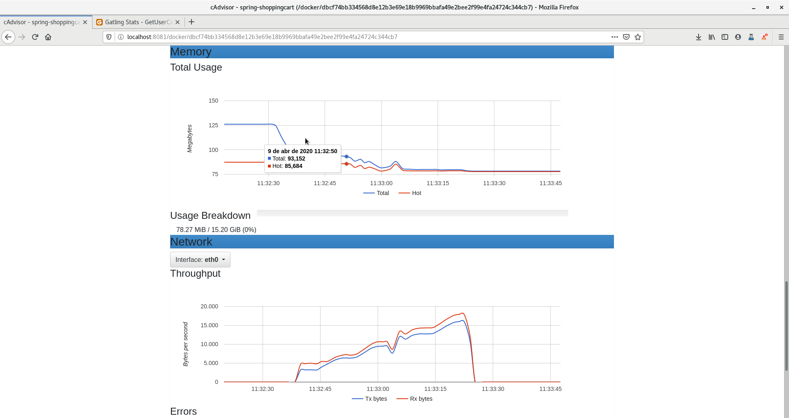
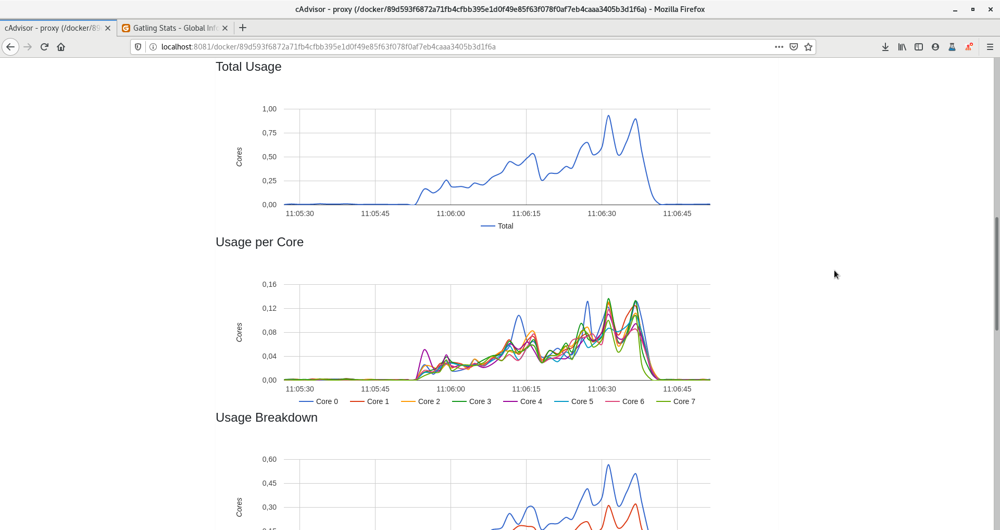
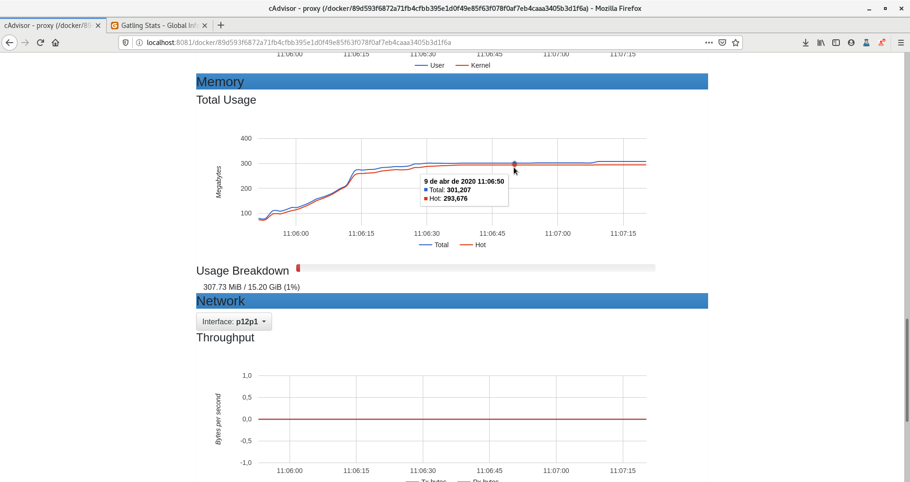

## There is no Free Lunch!

This document is for informational purposes only. Little or no conclusion will be drawn from here, 
it is just interesting data that I want to share.
Like all performance tests, local variables will always change the results.

Once we have a native proxy image, compiled via GraalVM, and an image of the user function compiled in a JVM, 
we have a good opportunity to perform some general performance measures.
Our docker image based on [Springboot support on Cloudstate](https://github.com/sleipnir/spring-boot-cloudstate-starter) 
is generated by the [Google Jib](https://cloud.google.com/blog/products/gcp/introducing-jib-build-java-docker-images-better) 
[plug-in](https://github.com/GoogleContainerTools/jib/tree/master/jib-maven-plugin) and has as its base 
layer an image [adoptedpenjdk/openjdk8-openj9:alpine-slim](https://hub.docker.com/r/adoptopenjdk/openjdk8-openj9/).

We added some parameters recommended by the [OpenJ9](https://www.eclipse.org/openj9/) [documentation](https://www.eclipse.org/openj9/docs/) 
for a faster startup and a smaller footprint:

```xml
<jvmFlag> -XshareClasses </jvmFlag>
<jvmFlag> -Xquickstart </jvmFlag>
```

The whole plugin is configured this way:

```xml
<plugin>
    <groupId> com.google.cloud.tools </groupId>
    <artifactId> jib-maven-plugin </artifactId>
    <version> 1.7.0 </version>
    <executions>
        <execution>
            <phase>package</phase>
            <goals>
                <goal>build</goal>
            </goals>
        </execution>
    </executions>
    <configuration>
        <from>
            <image>adoptopenjdk/openjdk8-openj9:alpine-slim</image>
            <credHelper> </credHelper>
        </from>
        <to>
            <image>sleipnir/cloudstate-boot-example</image>
            <credHelper> </credHelper>
            <tags>
                <tag>${project.version}</tag>
            </tags>
        </to>
        <container>
            <mainClass>${main.class}</mainClass>
            <jvmFlags>
                <jvmFlag>-XshareClasses</jvmFlag>
                <jvmFlag>-Xquickstart</jvmFlag>
                <jvmFlag>-XX:+UseG1GC</jvmFlag>
                <jvmFlag>-XX:+UseStringDeduplication</jvmFlag>
            </jvmFlags>
            <ports>
                <port>8080</port>
            </ports>
        </container>
    </configuration>
</plugin>
```

This configuration will generate a modest docker image, that is, neither too large nor too small:

```shell script
# docker images
REPOSITORY                                      TAG                 IMAGE ID            CREATED             SIZE
sleipnir/cloudstate-boot-example                0.4.3               eccd2e37de44        50 years ago        161MB
cloudstateio/cloudstate-proxy-native-dev-mode   latest              fed44820c73c        4 months ago        477MB

```

In turn, the proxy we use is a native image compiled via GraalVM. As we saw above, the generated image is a little big (477MB) 
and could be optimized to be a little better according to this discussion [here](https://github.com/cloudstateio/cloudstate/pull/207#issuecomment-601248956).

The exception of this detail of the image size is "known" that native images have a faster boot time during boot and in 
general have a smaller footprint of memory during execution.

Well, it does start significantly faster than similar JVM application, but at the end, when the application runs f
or a long time, the just-in-time compiler can actually outperform the AOT one. 

As the helidon.io team puts it:

“On the other hand, everything is always a tradeoff. Long running applications on traditional JVMs are still 
demonstrating better performance than GraalVM native executables due to runtime optimization. The key word here 
is long-running; for short-running applications like 'serverless **stateless** functions', native executables have a performance advantage. 
So, you need to decide yourself between fast startup time and small size (and the additional step of building the native executable) 
versus better performance for long-running applications. ”

"***The stateless in bold it's author's note :D***"

## Now that we have some context let's go to the tests

First I wrote a short test via Gatling framework.
We see in this test that we are going to test a very simple feature of ShoppingCart example and that we are not doing much.

Gatling test code:

```scala
package io.cloudstate.springboot.example

import scala.concurrent.duration._

import io.gatling.core.Predef._
import io.gatling.core.structure.{ChainBuilder, ScenarioBuilder}
import io.gatling.http.Predef._
import io.gatling.http.protocol.HttpProtocolBuilder

class LoadTest extends Simulation {

  val httpProtocol: HttpProtocolBuilder = http
    .baseUrl("http://localhost:9000")

  object GetCartResource {
    val get: ChainBuilder = exec(http("GetUserCart")
      .get("/carts/adriano/items"))
  }

  val shoppingCartScenario: ScenarioBuilder = scenario("RampUpUsers")
    .exec(GetCartResource.get)

  setUp(shoppingCartScenario.inject(
    incrementUsersPerSec(20)
      .times(5)
      .eachLevelLasting(5 seconds)
      .separatedByRampsLasting(5 seconds)
      .startingFrom(20)
  )).protocols(httpProtocol)
    .assertions(global.successfulRequests.percent.is(100))
}

```

Then what we have to do is start our compiled user role. And run our test with **mvn gatling:test**

Cloudstate Springboot startup:



Cloudstate CLI starting Proxy:



Tests results:








Cloudstate Springboot User function:







Cloudsatate Proxy:





Click on the image below to see the video of the docker statistics. The first 30 seconds are from the resting environment:

[](https://asciinema.org/a/H8IzG9tdEsgPqkZiXfrQ6UN3D)

Well the graphics and evidence speak for themselves, but in summary we can see that the use of cpu at rest for both 
applications is very good, as well as the memory consumption is acceptable. However, this changes a little when we start 
running the test, we can see some CPU spikes mainly in the Proxy, nothing I didn't expect from an application compiled in GraalVM. 
But what really surprised us was the increasing memory usage of the Proxy, which doesn't seem 
to complain about any cleaning during and after the test. Undoubtedly, something to be investigated since it is to be expected 
that in "pay for what you use" environments you will not want to be consuming memory without traffic.

In terms of performance the test was excellent because, in addition to all requests having been successfully executed, 
the throughtput was spectacular as we can see in the Gatling report.


I added a [ticket](https://github.com/cloudstateio/cloudstate/issues/235) to Cloudstate and I hope these insights can help the platform evolve.

Environment details:

```shell script
# uname -a
Linux sleipnir 3.10.0-957.27.2.el7.x86_64 #1 SMP Mon Jul 29 17:46:05 UTC 2019 x86_64 x86_64 x86_64 GNU/Linux

# cat /etc/centos-release
CentOS Linux release 7.7.1908 (Core)

# docker version
Client: Docker Engine - Community
 Version:           19.03.6
 API version:       1.40
 Go version:        go1.12.16
 Git commit:        369ce74a3c
 Built:             Thu Feb 13 01:29:29 2020
 OS/Arch:           linux/amd64
 Experimental:      false

Server: Docker Engine - Community
 Engine:
  Version:          19.03.6
  API version:      1.40 (minimum version 1.12)
  Go version:       go1.12.16
  Git commit:       369ce74a3c
  Built:            Thu Feb 13 01:28:07 2020
  OS/Arch:          linux/amd64
  Experimental:     false
 containerd:
  Version:          1.2.10
  GitCommit:        b34a5c8af56e510852c35414db4c1f4fa6172339
 runc:
  Version:          1.0.0-rc8+dev
  GitCommit:        3e425f80a8c931f88e6d94a8c831b9d5aa481657
 docker-init:
  Version:          0.18.0
  GitCommit:        fec3683

# cat /proc/cpuinfo 
processor       : 0
vendor_id       : GenuineIntel
cpu family      : 6
model           : 142
model name      : Intel(R) Core(TM) i7-8565U CPU @ 1.80GHz
stepping        : 11
microcode       : 0xca
cpu MHz         : 795.654
cache size      : 8192 KB
physical id     : 0
siblings        : 8
core id         : 0
cpu cores       : 4
apicid          : 0
initial apicid  : 0
fpu             : yes
fpu_exception   : yes
cpuid level     : 22
wp              : yes
flags           : fpu vme de pse tsc msr pae mce cx8 apic sep mtrr pge mca cmov pat pse36 clflush dts acpi mmx fxsr sse sse2 ss ht tm pbe syscall nx pdpe1gb rdtscp lm constant_tsc art arch_perfmon pebs bts rep_good nopl xtopology nonstop_tsc aperfmperf eagerfpu pni pclmulqdq dtes64 monitor ds_cpl vmx est tm2 ssse3 sdbg fma cx16 xtpr pdcm pcid sse4_1 sse4_2 x2apic movbe popcnt tsc_deadline_timer aes xsave avx f16c rdrand lahf_lm abm 3dnowprefetch epb intel_pt ssbd ibrs ibpb stibp tpr_shadow vnmi flexpriority ept vpid fsgsbase tsc_adjust bmi1 avx2 smep bmi2 erms invpcid mpx rdseed adx smap clflushopt xsaveopt xsavec xgetbv1 dtherm ida arat pln pts hwp hwp_notify hwp_act_window hwp_epp md_clear spec_ctrl intel_stibp flush_l1d arch_capabilities
bogomips        : 3984.00
clflush size    : 64
cache_alignment : 64
address sizes   : 39 bits physical, 48 bits virtual
power management:

processor       : 1
vendor_id       : GenuineIntel
cpu family      : 6
model           : 142
model name      : Intel(R) Core(TM) i7-8565U CPU @ 1.80GHz
stepping        : 11
microcode       : 0xca
cpu MHz         : 784.179
cache size      : 8192 KB
physical id     : 0
siblings        : 8
core id         : 1
cpu cores       : 4
apicid          : 2
initial apicid  : 2
fpu             : yes
fpu_exception   : yes
cpuid level     : 22
wp              : yes
flags           : fpu vme de pse tsc msr pae mce cx8 apic sep mtrr pge mca cmov pat pse36 clflush dts acpi mmx fxsr sse sse2 ss ht tm pbe syscall nx pdpe1gb rdtscp lm constant_tsc art arch_perfmon pebs bts rep_good nopl xtopology nonstop_tsc aperfmperf eagerfpu pni pclmulqdq dtes64 monitor ds_cpl vmx est tm2 ssse3 sdbg fma cx16 xtpr pdcm pcid sse4_1 sse4_2 x2apic movbe popcnt tsc_deadline_timer aes xsave avx f16c rdrand lahf_lm abm 3dnowprefetch epb intel_pt ssbd ibrs ibpb stibp tpr_shadow vnmi flexpriority ept vpid fsgsbase tsc_adjust bmi1 avx2 smep bmi2 erms invpcid mpx rdseed adx smap clflushopt xsaveopt xsavec xgetbv1 dtherm ida arat pln pts hwp hwp_notify hwp_act_window hwp_epp md_clear spec_ctrl intel_stibp flush_l1d arch_capabilities
bogomips        : 3984.00
clflush size    : 64
cache_alignment : 64
address sizes   : 39 bits physical, 48 bits virtual
power management:

processor       : 2
vendor_id       : GenuineIntel
cpu family      : 6
model           : 142
model name      : Intel(R) Core(TM) i7-8565U CPU @ 1.80GHz
stepping        : 11
microcode       : 0xca
cpu MHz         : 796.386
cache size      : 8192 KB
physical id     : 0
siblings        : 8
core id         : 2
cpu cores       : 4
apicid          : 4
initial apicid  : 4
fpu             : yes
fpu_exception   : yes
cpuid level     : 22
wp              : yes
flags           : fpu vme de pse tsc msr pae mce cx8 apic sep mtrr pge mca cmov pat pse36 clflush dts acpi mmx fxsr sse sse2 ss ht tm pbe syscall nx pdpe1gb rdtscp lm constant_tsc art arch_perfmon pebs bts rep_good nopl xtopology nonstop_tsc aperfmperf eagerfpu pni pclmulqdq dtes64 monitor ds_cpl vmx est tm2 ssse3 sdbg fma cx16 xtpr pdcm pcid sse4_1 sse4_2 x2apic movbe popcnt tsc_deadline_timer aes xsave avx f16c rdrand lahf_lm abm 3dnowprefetch epb intel_pt ssbd ibrs ibpb stibp tpr_shadow vnmi flexpriority ept vpid fsgsbase tsc_adjust bmi1 avx2 smep bmi2 erms invpcid mpx rdseed adx smap clflushopt xsaveopt xsavec xgetbv1 dtherm ida arat pln pts hwp hwp_notify hwp_act_window hwp_epp md_clear spec_ctrl intel_stibp flush_l1d arch_capabilities
bogomips        : 3984.00
clflush size    : 64
cache_alignment : 64
address sizes   : 39 bits physical, 48 bits virtual
power management:

processor       : 3
vendor_id       : GenuineIntel
cpu family      : 6
model           : 142
model name      : Intel(R) Core(TM) i7-8565U CPU @ 1.80GHz
stepping        : 11
microcode       : 0xca
cpu MHz         : 799.926
cache size      : 8192 KB
physical id     : 0
siblings        : 8
core id         : 3
cpu cores       : 4
apicid          : 6
initial apicid  : 6
fpu             : yes
fpu_exception   : yes
cpuid level     : 22
wp              : yes
flags           : fpu vme de pse tsc msr pae mce cx8 apic sep mtrr pge mca cmov pat pse36 clflush dts acpi mmx fxsr sse sse2 ss ht tm pbe syscall nx pdpe1gb rdtscp lm constant_tsc art arch_perfmon pebs bts rep_good nopl xtopology nonstop_tsc aperfmperf eagerfpu pni pclmulqdq dtes64 monitor ds_cpl vmx est tm2 ssse3 sdbg fma cx16 xtpr pdcm pcid sse4_1 sse4_2 x2apic movbe popcnt tsc_deadline_timer aes xsave avx f16c rdrand lahf_lm abm 3dnowprefetch epb intel_pt ssbd ibrs ibpb stibp tpr_shadow vnmi flexpriority ept vpid fsgsbase tsc_adjust bmi1 avx2 smep bmi2 erms invpcid mpx rdseed adx smap clflushopt xsaveopt xsavec xgetbv1 dtherm ida arat pln pts hwp hwp_notify hwp_act_window hwp_epp md_clear spec_ctrl intel_stibp flush_l1d arch_capabilities
bogomips        : 3984.00
clflush size    : 64
cache_alignment : 64
address sizes   : 39 bits physical, 48 bits virtual
power management:

processor       : 4
vendor_id       : GenuineIntel
cpu family      : 6
model           : 142
model name      : Intel(R) Core(TM) i7-8565U CPU @ 1.80GHz
stepping        : 11
microcode       : 0xca
cpu MHz         : 752.075
cache size      : 8192 KB
physical id     : 0
siblings        : 8
core id         : 0
cpu cores       : 4
apicid          : 1
initial apicid  : 1
fpu             : yes
fpu_exception   : yes
cpuid level     : 22
wp              : yes
flags           : fpu vme de pse tsc msr pae mce cx8 apic sep mtrr pge mca cmov pat pse36 clflush dts acpi mmx fxsr sse sse2 ss ht tm pbe syscall nx pdpe1gb rdtscp lm constant_tsc art arch_perfmon pebs bts rep_good nopl xtopology nonstop_tsc aperfmperf eagerfpu pni pclmulqdq dtes64 monitor ds_cpl vmx est tm2 ssse3 sdbg fma cx16 xtpr pdcm pcid sse4_1 sse4_2 x2apic movbe popcnt tsc_deadline_timer aes xsave avx f16c rdrand lahf_lm abm 3dnowprefetch epb intel_pt ssbd ibrs ibpb stibp tpr_shadow vnmi flexpriority ept vpid fsgsbase tsc_adjust bmi1 avx2 smep bmi2 erms invpcid mpx rdseed adx smap clflushopt xsaveopt xsavec xgetbv1 dtherm ida arat pln pts hwp hwp_notify hwp_act_window hwp_epp md_clear spec_ctrl intel_stibp flush_l1d arch_capabilities
bogomips        : 3984.00
clflush size    : 64
cache_alignment : 64
address sizes   : 39 bits physical, 48 bits virtual
power management:

processor       : 5
vendor_id       : GenuineIntel
cpu family      : 6
model           : 142
model name      : Intel(R) Core(TM) i7-8565U CPU @ 1.80GHz
stepping        : 11
microcode       : 0xca
cpu MHz         : 800.048
cache size      : 8192 KB
physical id     : 0
siblings        : 8
core id         : 1
cpu cores       : 4
apicid          : 3
initial apicid  : 3
fpu             : yes
fpu_exception   : yes
cpuid level     : 22
wp              : yes
flags           : fpu vme de pse tsc msr pae mce cx8 apic sep mtrr pge mca cmov pat pse36 clflush dts acpi mmx fxsr sse sse2 ss ht tm pbe syscall nx pdpe1gb rdtscp lm constant_tsc art arch_perfmon pebs bts rep_good nopl xtopology nonstop_tsc aperfmperf eagerfpu pni pclmulqdq dtes64 monitor ds_cpl vmx est tm2 ssse3 sdbg fma cx16 xtpr pdcm pcid sse4_1 sse4_2 x2apic movbe popcnt tsc_deadline_timer aes xsave avx f16c rdrand lahf_lm abm 3dnowprefetch epb intel_pt ssbd ibrs ibpb stibp tpr_shadow vnmi flexpriority ept vpid fsgsbase tsc_adjust bmi1 avx2 smep bmi2 erms invpcid mpx rdseed adx smap clflushopt xsaveopt xsavec xgetbv1 dtherm ida arat pln pts hwp hwp_notify hwp_act_window hwp_epp md_clear spec_ctrl intel_stibp flush_l1d arch_capabilities
bogomips        : 3984.00
clflush size    : 64
cache_alignment : 64
address sizes   : 39 bits physical, 48 bits virtual
power management:

processor       : 6
vendor_id       : GenuineIntel
cpu family      : 6
model           : 142
model name      : Intel(R) Core(TM) i7-8565U CPU @ 1.80GHz
stepping        : 11
microcode       : 0xca
cpu MHz         : 791.503
cache size      : 8192 KB
physical id     : 0
siblings        : 8
core id         : 2
cpu cores       : 4
apicid          : 5
initial apicid  : 5
fpu             : yes
fpu_exception   : yes
cpuid level     : 22
wp              : yes
flags           : fpu vme de pse tsc msr pae mce cx8 apic sep mtrr pge mca cmov pat pse36 clflush dts acpi mmx fxsr sse sse2 ss ht tm pbe syscall nx pdpe1gb rdtscp lm constant_tsc art arch_perfmon pebs bts rep_good nopl xtopology nonstop_tsc aperfmperf eagerfpu pni pclmulqdq dtes64 monitor ds_cpl vmx est tm2 ssse3 sdbg fma cx16 xtpr pdcm pcid sse4_1 sse4_2 x2apic movbe popcnt tsc_deadline_timer aes xsave avx f16c rdrand lahf_lm abm 3dnowprefetch epb intel_pt ssbd ibrs ibpb stibp tpr_shadow vnmi flexpriority ept vpid fsgsbase tsc_adjust bmi1 avx2 smep bmi2 erms invpcid mpx rdseed adx smap clflushopt xsaveopt xsavec xgetbv1 dtherm ida arat pln pts hwp hwp_notify hwp_act_window hwp_epp md_clear spec_ctrl intel_stibp flush_l1d arch_capabilities
bogomips        : 3984.00
clflush size    : 64
cache_alignment : 64
address sizes   : 39 bits physical, 48 bits virtual
power management:

processor       : 7
vendor_id       : GenuineIntel
cpu family      : 6
model           : 142
model name      : Intel(R) Core(TM) i7-8565U CPU @ 1.80GHz
stepping        : 11
microcode       : 0xca
cpu MHz         : 745.117
cache size      : 8192 KB
physical id     : 0
siblings        : 8
core id         : 3
cpu cores       : 4
apicid          : 7
initial apicid  : 7
fpu             : yes
fpu_exception   : yes
cpuid level     : 22
wp              : yes
flags           : fpu vme de pse tsc msr pae mce cx8 apic sep mtrr pge mca cmov pat pse36 clflush dts acpi mmx fxsr sse sse2 ss ht tm pbe syscall nx pdpe1gb rdtscp lm constant_tsc art arch_perfmon pebs bts rep_good nopl xtopology nonstop_tsc aperfmperf eagerfpu pni pclmulqdq dtes64 monitor ds_cpl vmx est tm2 ssse3 sdbg fma cx16 xtpr pdcm pcid sse4_1 sse4_2 x2apic movbe popcnt tsc_deadline_timer aes xsave avx f16c rdrand lahf_lm abm 3dnowprefetch epb intel_pt ssbd ibrs ibpb stibp tpr_shadow vnmi flexpriority ept vpid fsgsbase tsc_adjust bmi1 avx2 smep bmi2 erms invpcid mpx rdseed adx smap clflushopt xsaveopt xsavec xgetbv1 dtherm ida arat pln pts hwp hwp_notify hwp_act_window hwp_epp md_clear spec_ctrl intel_stibp flush_l1d arch_capabilities
bogomips        : 3984.00
clflush size    : 64
cache_alignment : 64
address sizes   : 39 bits physical, 48 bits virtual
power management:

```